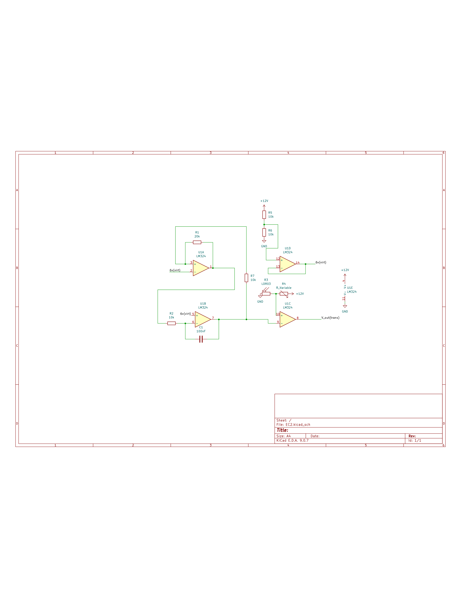
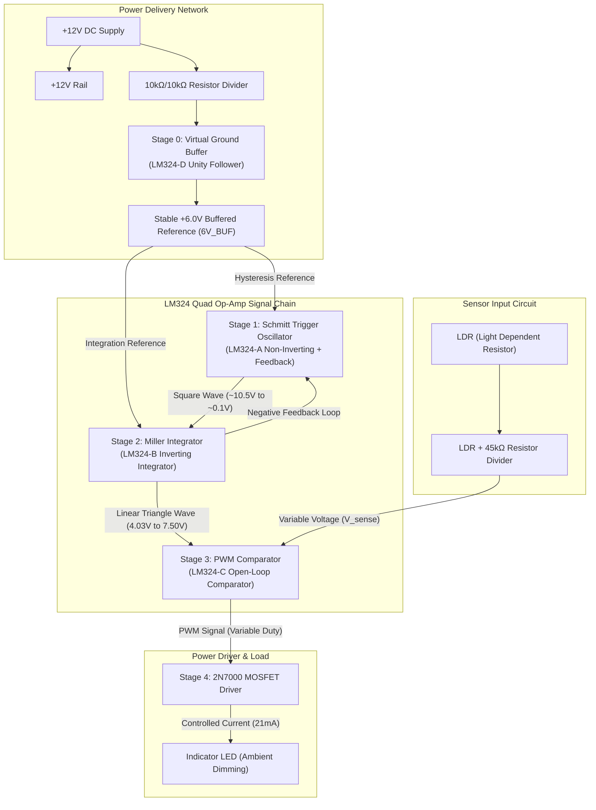

# ⚡ Op-Amp PWM LED Intensity Controller (Microcontroller-Free)

> A fully microcontroller-free ambient light controller that automatically dims an LED using Pulse Width Modulation — built entirely from a single LM324 quad op-amp IC and passive components.

### 🔌 Complete System Schematic Diagram

The active hardware schematic layout is integrated below. A vector-precision PDF version of this circuit layout is available at: 📄 **[opamp_pwm_led_schematic.pdf](opamp_pwm_led_schematic.pdf)** and the LTspice simulation model is available at: 🔬 **[opamp_pwm_led_simulation.asc](opamp_pwm_led_simulation.asc)**



---

## 💡 Overview

This project generates a variable-duty-cycle PWM signal using **zero digital components** — no microcontroller, no FPGA, no 555 timer. All four op-amp units inside a single LM324 DIP-14 are utilized in a cascaded analog signal chain:

**Schmitt Trigger** → **Miller Integrator** → **PWM Comparator** → **MOSFET Driver**

An LDR (Light Dependent Resistor) senses ambient light, and the circuit automatically adjusts LED brightness: bright room → LED off, dark room → LED fully on, with proportional dimming in between.

---

## 🏗️ Circuit Architecture



---

## 📐 Stage-by-Stage Breakdown

### Stage 0 — Virtual Ground Buffer (LM324-D)
| Parameter | Value |
|-----------|-------|
| Topology | Unity-gain voltage follower |
| Input | 10kΩ + 10kΩ resistor divider from 12V |
| Output | Low-impedance 6.0V reference (6V_BUF) |
| Decoupling | 10µF electrolytic + 100nF ceramic |

### Stage 1 — Schmitt Trigger / Square Wave Generator (LM324-A)
| Parameter | Value |
|-----------|-------|
| Topology | Positive feedback (non-inverting) |
| Feedback resistors | R1 = 10kΩ (to 6V), R2 = 20kΩ (to output) |
| Output swing | V_OH ≈ 10.5V, V_OL ≈ 0.1V |
| Upper threshold (V_TH) | **7.50V** |
| Lower threshold (V_TL) | **4.03V** |
| Hysteresis window | 3.47V |

### Stage 2 — Miller Integrator / Triangle Wave Generator (LM324-B)
| Parameter | Value |
|-----------|-------|
| Topology | Negative feedback (inverting integrator) |
| R_in | 10kΩ |
| C_int | 100nF |
| Output | Linear triangle wave, 4.03V – 7.50V |
| Frequency | **~735 Hz** |
| Rise time | ~588µs |
| Fall time | ~771µs |
| Slew rates | Charge: 4500 V/s, Discharge: 5900 V/s |

*Note: Ideal frequency would be 500 Hz, but asymmetry arises from the LM324's non-rail-to-rail output swing.*

### Stage 3 — PWM Comparator + Light Sensor (LM324-C)
| Parameter | Value |
|-----------|-------|
| Topology | Open-loop comparator |
| IN− | Triangle wave (from Stage 2) |
| IN+ | Sensor voltage (V_sense) from LDR divider |
| LDR partner resistor | 45kΩ fixed |
| Bright room | V_sense ≈ 2.18V → **0% duty** (LED off) |
| Dark room | V_sense ≈ 8.28V → **100% duty** (LED on) |
| Medium light | Proportional PWM duty cycle |

### Stage 4 — Power Driver
| Option | Component | Details |
|--------|-----------|---------|
| MOSFET | 2N7000 N-Channel | Gate resistor: 100Ω–4.7kΩ |
| BJT | 2N2222 NPN | Base resistor: 4.7kΩ (I_B ≈ 2.08mA) |
| Load | 5V LED | Series 470Ω resistor (I_LED ≈ 21mA) |

---

## 🔧 Components

| Component | Quantity | Value/Part |
|-----------|----------|------------|
| LM324 Quad Op-Amp | 1 | DIP-14 |
| LDR | 1 | — |
| 2N7000 MOSFET *or* 2N2222 BJT | 1 | — |
| LED | 1 | Standard 5V |
| Resistors | 4× 10kΩ, 1× 20kΩ, 1× 45kΩ, 1× 470Ω, 1× 4.7kΩ | — |
| Capacitors | 1× 100nF (integrator), 1× 10µF + 1× 100nF (decoupling) | — |
| Power Supply | 1 | 12V DC |

> ⚠️ **CAUTION:** LM324 pinout — **Pin 4 = VCC (+12V)**, **Pin 11 = GND**. Earlier drafts of this project had these swapped. Reversing them will destroy the chip.

---

## 🖥️ Simulation

Compatible with **LTspice** and **KiCad (ngspice)**:

| Setting | Value |
|---------|-------|
| Analysis | Transient |
| Time step | 10µs |
| Final time | 20ms |
| Initial conditions | **Must enable `.uic`** to kick-start oscillator |
| Probe points | Pin 7 (triangle wave), Pin 1 (square wave) |

---

## 🔬 Hardware Debugging Tests

1. **Comparator Forced Override** — Disconnect the LDR divider and manually force Pin 10 to GND (→ LED off) or 12V (→ LED full on) to verify the comparator + driver chain works independently.

2. **Sensor Divider Voltage Sweep** — Place a multimeter on Pin 10. Vary ambient light (cover/uncover LDR). Confirm V_sense sweeps across the triangle wave window (4.03V – 7.50V). If V_sense never enters this range, adjust the 45kΩ partner resistor.

---

## 📁 Project Structure

```
opamp-pwm-led-intensity-controller/
├── opamp_pwm_led_schematic.pdf    ← Complete hardware circuit schematic (PDF)
├── opamp_pwm_led_simulation.asc   ← LTspice circuit simulation schematic
├── images/
│   └── opamp_pwm_led_schematic.png ← High-resolution schematic preview image
└── README.md                      ← Project documentation
```

---

## 🚀 Build It

1. Wire the circuit on a breadboard following the schematic
2. Power with 12V DC (bench supply or adapter)
3. Verify 6V at the virtual ground buffer output
4. Check for a square wave on LM324-A output (Pin 1)
5. Check for a triangle wave on LM324-B output (Pin 7)
6. Vary lighting → LED brightness should change proportionally

---

## 💡 Lessons Learned

1. **Virtual Ground Is Essential** — On a single-supply op-amp, you can't reference signals to 0V for AC signal processing. The buffered 6V midpoint acts as a "virtual ground" that all AC signals swing around. Without the buffer, source impedance variations corrupted the reference.

2. **Initial Conditions Matter** — In simulation, the Schmitt trigger + integrator feedback loop won't start oscillating without `.uic` (use initial conditions). In hardware, component noise provides the initial kick, but in simulation you must explicitly enable it.

3. **Non-Rail-to-Rail Asymmetry** — The LM324 can swing close to GND (~0.1V) but not close to VCC (~10.5V vs 12V). This creates asymmetric rise/fall times in the triangle wave, shifting the frequency from the ideal 500 Hz to the measured 735 Hz.

---

## 👤 Author

**Balaji Rayudu S**  
B.Tech Electronics & Computers Engineering  
Amrita Vishwa Vidyapeetham, Bengaluru

